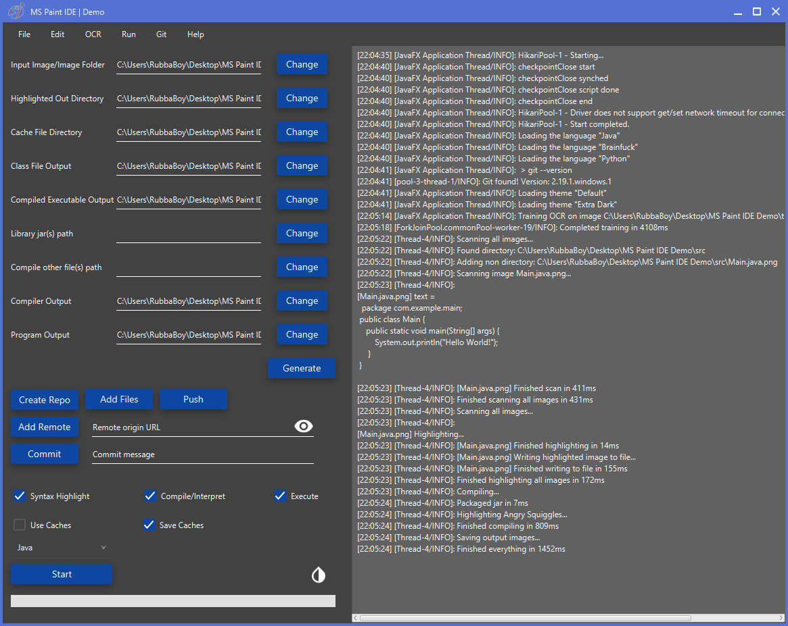
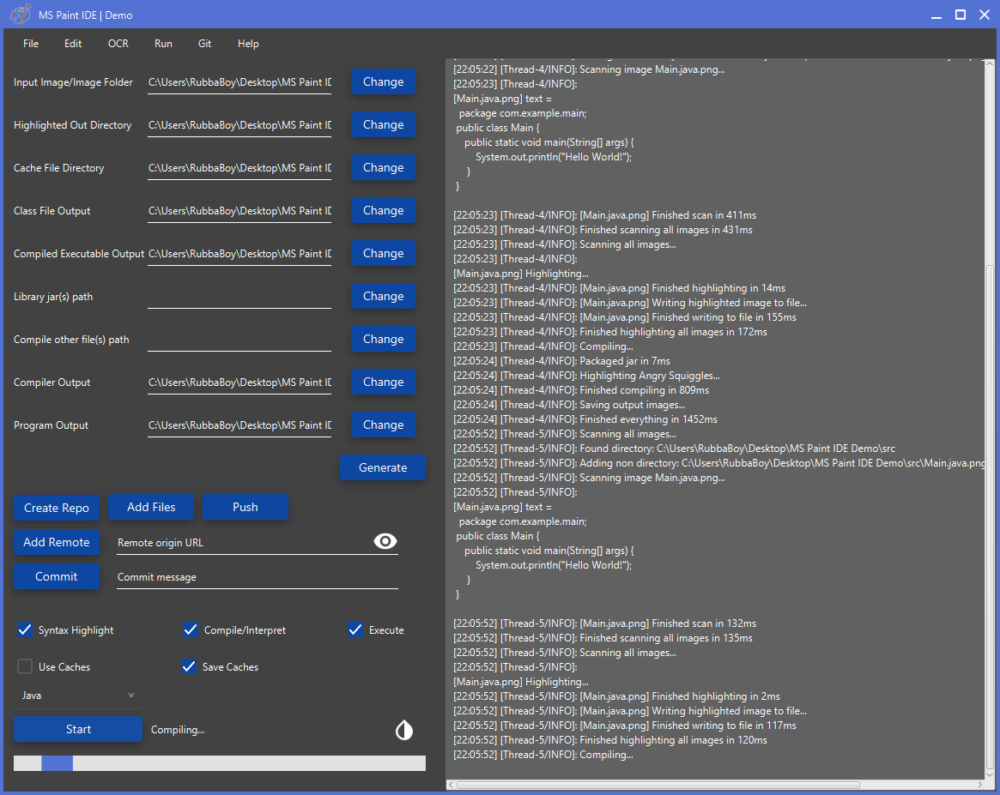
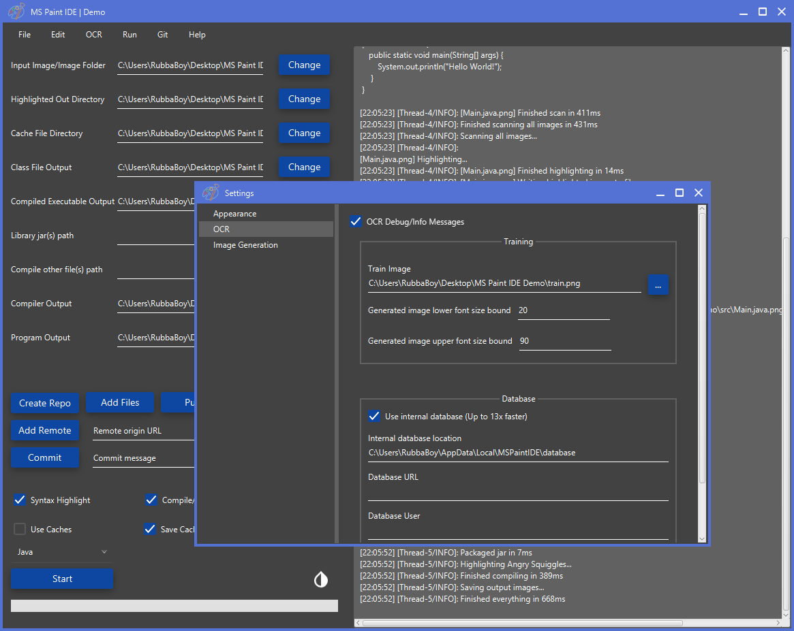
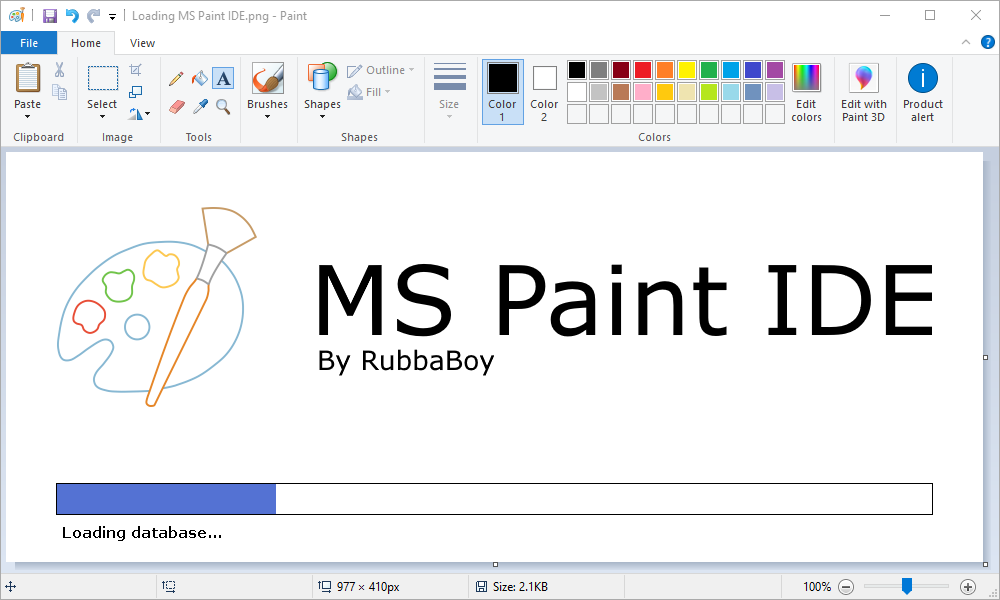
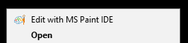
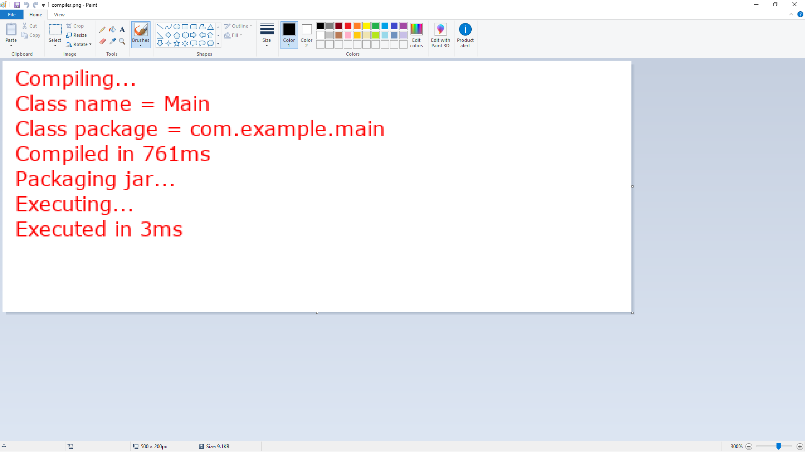
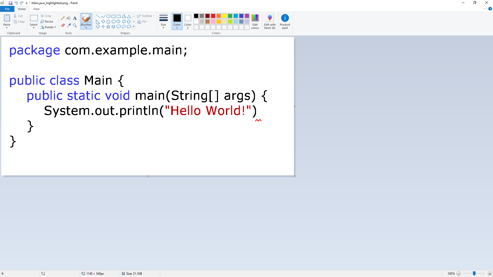
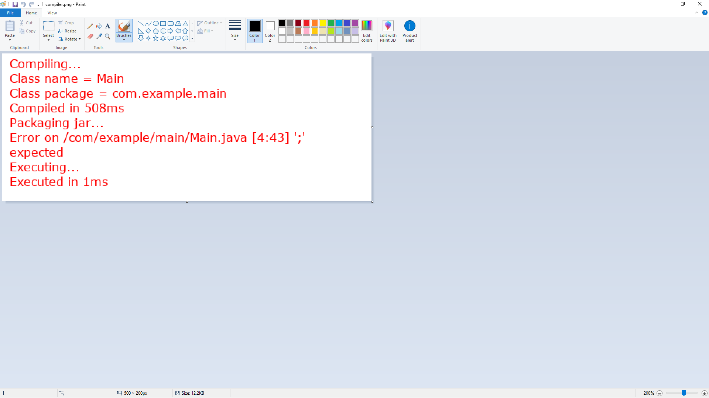

<h1 align="center">
  
  
  
  
  
</h1>
<h1 align="center">
    
</h1>

  <b>
    <a href="https://www.spigotmc.org/threads/programming-in-ms-paint.289868">Spigot</a> |
    <a href="https://ms-paint-i.de/">Website</a> |
    <a href="https://discord.gg/RXmPkPJ">Discord</a> |
    <a href="https://www.youtube.com/watch?v=eyH4aXlB1Js">Installation/Demo</a> |
    <a href="https://github.com/RubbaBoy/NewOCR">Custom OCR</a>
  </b>

People joke about what IDE they use often, things like Word, MS Notepad, sometimes even _Eclipse_, and then often times MS Paint. People joke about MS Paint because it's not even a text editor, people joke about it because it doesn't have one feature in common with IDEs. Well, this application gives MS Paint a boost, and lets MS Paint highlight, compile, and execute code, with just a few clicks of a button, and only text coming from MS Paint. It is now much more practical than things like Word, Notepad, and obviously _Eclipse_.

Note: This README is relating to the currently unreleased version of MS Paint IDE from git, due to the amounts of changes.

## Table of Contents

- [Features](#Features)
  - [Planned Features](#Planned-Features)
- [Projects](#Projects)
- [How It Works](#How-It-Works)
  - [Context Menu](#Context-Menu)
  - [MS Paint Integration](#MS-Paint-Integration)
- [Using](#Using)
- [Development](#Development)
- [Donations](#Donations)
  - [Special Thanks](#special-thanks)
- [Screenshots](#Screenshots)
  - [The Main GUI](#The-Main-GUI)
  - [External Features](#External-Features)
  - [Compiling](#Compiling)
  - [Compiling With Errors](#Compiling-With-Errors)

# Features

MS Paint IDE has grown an insane amount over the past year, and I plan for it to grow even more in the following year. Currently, these are some of the features present in MS Paint IDE:

- Can read, parse, and highlight code from purely image files
- Finding and replacing of text from image files
- Supports Java, Brainfuck, and Python*, with more planned
  - Also includes very simple language API to add custom languages
- Git tools, to create and manage your project in Git from within the IDE
- Right-click context menu to open and edit ANY text file in an MS Paint instance <small>[(details)](#Context-Menu)</small>
- Integrated buttons within MS Paint (No program modifications) to do basic IDE tasks* <small>[(details)](#MS-Paint-Integration)</small>
- Native installer for easy usage
- IDE theming via CSS files*

\* Feature is still under development/unstable

## Planned Features

MS Paint IDE has many features, however it will not stop there. Some of these planned features are easier than others to implement, but I understand how much the programming community wants these, so I will try my best.

- Gradle/maven support
- Natural image processing with [NewOCR](https://github.com/RubbaBoy/NewOCR/)
- Improving [PaintInjector](https://github.com/RubbaBoy/PaintInjector) to provide with an image modification API
  - Live debugging with line highlights from MS Paint
  - Autocompletition
  - Inspections
- More languages
- Auto updater/checker
- Implement [LSP](https://microsoft.github.io/language-server-protocol/)
- Acquire [JetBrains](https://www.jetbrains.com/)

# Projects

The MS Paint IDE project originated from just this repository, however over the past year the project has grown into 5 total repositories. Here is a link and description of each one, along with its creation date and primary language:

**[MS Paint IDE](https://github.com/RubbaBoy/MSPaintIDE)** [12/9/2017 **Java**] - The main IDE with all the core features

**[MS Paint IDE Website](https://github.com/RubbaBoy/MSPaintIDEWebsite)** [4/9/2018 **Dart**] - The previous website wasn't on GitHub, and was a horrible, unreactive mess. This repository was created, so now it's a horrible, _reactive_ mess. It uses the Dart language and AngularDart framework, which are some things I was been playing with prior to making MS Paint IDE.

**[NewOCR](https://github.com/RubbaBoy/NewOCR)** [9/18/2018 **Java**] - When there was an obvious need to rework the internal OCR of MS Paint IDE at the time, this repository was created originally as a research/test environment. Slowly this grew after much research and testing into its own standalone OCR.

**[OpenTitlebarButtons Fork](https://github.com/RubbaBoy/OpenTitlebarButtons)** [1/19/2019 **C#**] - This is a fork of a project by [NickAcPT](https://github.com/NickAcPT), which originally allowed the addition of an extra button on the titlebar of a window. It has been repurposed and heavily refactored to have the ability to add responsive buttons and text to any window, with the intent to be used with MS Paint IDE.

**[PaintInjector](https://github.com/RubbaBoy/PaintInjector)** [1/19/2019 **C#**] - This project is defendant on OpenTitlebarButtons, in that it adds all the buttons at their given locations to the window, handles some application-specific reactivity, and adds the hooks for the JVM so MS Paint IDE can interact with the generated DLL.

# How It Works

MS Paint IDE is an application that runs alongside MS Paint that reads its images you make from MS Paint. It then uses a custom [OCR](https://github.com/RubbaBoy/NewOCR/) to read, parse, highlight, and execute the text. All output files and logs are created as images, to show you the program output, and compilation/interpretation output.

## Context Menu
_[Relevant screenshots](#External-Features)_
The context menu item is a tool that is meant to aid any developer in need of quick modification of text files. When installing and if selected, some registry keys are added to run a headless IDE, that generates an image of the text file you right clicked. MS Paint is then opened from that resulting image and when you save the file it saves it back as text to the original file. Don't worry, a backup of your original text file _is_ saved in the `%LocalAppData%\MSPaintIDE\opened\backup` directory incase anything goes wrong, such as the OCR having problems, if the IDE happened to crash, etc.

## MS Paint Integration
_[Relevant screenshots](#External-Features)_
MS Paint IDE has the ability to add buttons for compiling, running, stopping, pushing, pulling, and committing your project from _within_ MS Paint. This is done in a C# DLL compiled from the project [PaintInjector](https://github.com/RubbaBoy/PaintInjector), specifically made for this IDE. All it does is creates a reactive overlay with the parent being MS Paint, with hooks to the Java program to do the specified IDE functions.

# Using

Using MS Paint IDE is extremely simple. First, download the .exe installer from the [latest release](https://github.com/RubbaBoy/MSPaintIDE/releases/latest). Go through the installer, and open the program once it's complete.

# Development

For development instructions, see the [packaging readme](https://github.com/RubbaBoy/MSPaintIDE/tree/master/package) _(Coming soon)_. It's a more advanced process than before, due to the installer and Java 11 updates.

# Donations

I've been doing mainly this project for over a year now, and even though I'm not making money off of it, I would be extremely appreciative for any contributions to help pay for the domain and the website's VPS. If you donate and want to be mentioned here, just put it in the donation message. Feel free to donate via  [PayPal](https://paypal.me/RubbaBoy).

Thank you very much to the current donators:

[@Mr. Midnight](https://www.spigotmc.org/members/11614/)

[@Stef](https://www.spigotmc.org/members/18736/)

[@iCodeHaven](https://www.spigotmc.org/members/482937/)

[@AL1L](https://al1l.com/)

<h2 name="special-thanks">Special Thanks To:</h2>

YourKit supports open source projects with its full-featured Java Profiler.
YourKit, LLC is the creator of <a href="https://www.yourkit.com/java/profiler/">YourKit Java Profiler</a>
and <a href="https://www.yourkit.com/.net/profiler/">YourKit .NET Profiler</a>,
innovative and intelligent tools for profiling Java and .NET applications.

# Screenshots

## The Main GUI
The main interface

Loading while compiling

The settings window

The splash screen

## External Features
This is of the context menu, where you can right click any file and it opens MS Paint to edit said text file. For more details, see the [Context Menu](#Context-Menu) section.

These buttons are created using PaintInject, from a DLL that is interfacing with the main IDE. For more details, see the [MS Paint Integration](#MS-Paint-Integration) section.

## Compiling
A fully highlighted Java file

The compiler's output of the above file 

## Compiling With Errors
A highlighted Java file with a missing semicolon

The compiler's output of the above file containing an error

